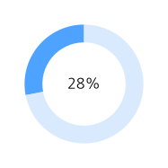
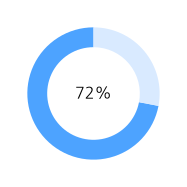
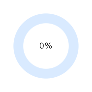

# 📘 StudyCodingTest
꾸준한 알고리즘 문제풀이 기록을 **대시보드 형태로 시각화**한 저장소입니다.

---

## 🟦 주요 통계 한눈에 보기

<table align="center">
<tr>

<td width="50%" align="center">

### 🔥 오늘 푼 문제
**0 문제**  

</td>

<td width="50%" align="center">

### 🎯 이번 주 목표 (10문제)
**10 / 10 문제**  

</td>

</tr>
<tr>

<td width="50%" align="center">

### 📚 누적 해결 문제 수
**총 50 문제**  

</td>

<td width="50%" align="center">

### 📂 카테고리 별 풀이 비율 (Donut)

</td>

</tr>
</table>

---

## 📈 최근 7일 누적 문제 풀이 변화

  

---

## 🕒 최근 7일 활동 내역

| 날짜 | 카테고리 | 문제명 |
|------|----------|---------|

---

 

⏰ **최근 업데이트:** 2025-12-11 14:55
