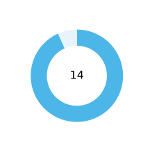
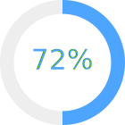

# 📘 StudyCodingTest
꾸준한 알고리즘 문제풀이 기록을 **대시보드 형태로 시각화**한 저장소입니다.

---

## 🟦 주요 통계 대시보드

<table>
<tr>
<td align="center" width="33%">

### 🔥 오늘 푼 문제

</td>
<td align="center" width="33%">

### 🎯 이번 주 목표

</td>
<td align="center" width="33%">

### 📚 누적 해결 문제

</td>
</tr>

<tr>
<td align="center">

### 📘 이코테 비율

</td>
<td align="center">

### 🚀 프로그래머스 비율

</td>
<td align="center">

### 🟢 BOJ 비율

</td>
</tr>
</table>

---

## 📈 최근 7일 누적 문제 변화

  

---

## 🕒 최근 7일 활동 내역

| 날짜 | 카테고리 | 문제명 |
|------|----------|---------|
{{RECENT_ACTIVITY_TABLE}}

---

⏰ **최근 업데이트:** {{LAST_UPDATE}}
