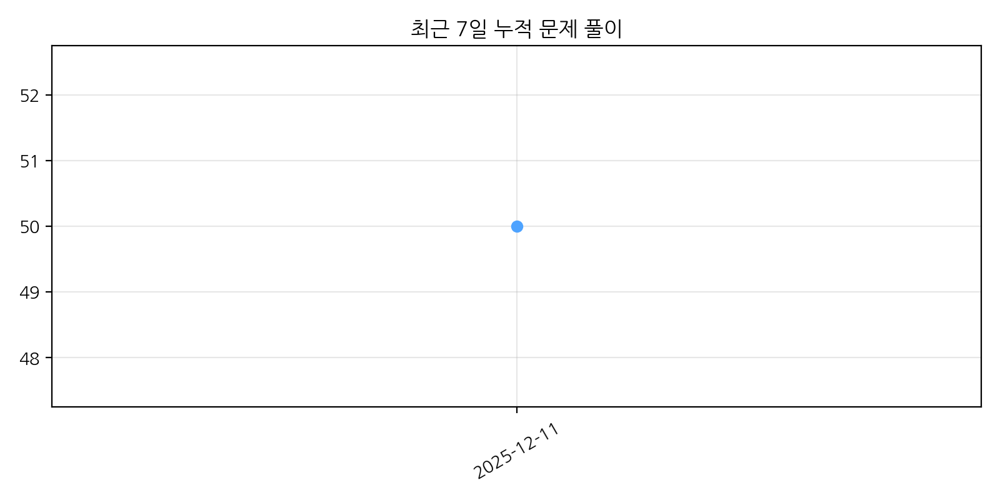

# 📘 StudyCodingTest
꾸준한 알고리즘 문제풀이 기록 저장소입니다.

---

<table>
<tr>
<td width="300">

### 🔥 오늘 푼 문제
**0 문제**

</td>
<td width="300">

### 🎯 이번 주 목표
10문제 중 6문제

</td>
<td width="300">

### 📊 누적 해결 문제 수
총 **50 문제**

</td>
</tr>

<tr>
<td colspan="3">

### 📈 문제 풀이 추세 그래프

</td>
</tr>

<tr>
<td colspan="3">

### 📂 카테고리별 문제 풀이 현황

| 카테고리 | 해결 문제 수 |
|---------|--------------|
| 📘 이코테(Java) | **14** |
| 🚀 프로그래머스 | **36** |
| 🟢 BOJ | **0** |

</td>
</tr>

<tr>
<td colspan="3">

### 🕒 최근 7일 활동 내역

| 날짜 | 카테고리 | 문제 |
|------|----------|------|
| 2025-12-11 | 프로그래머스 | 251210 : lv.1 3문제 - 크레인 인형뽑기 게임 - 성격 유형 검사 - 키패드 누르기 |
| 2025-12-10 | 이코테 | 251210  - BFS/DFS 2문제 - 정렬 개념 (선택정렬, 삽입정렬, 계수정렬, 내장 라이브러리) |
| 2025-12-10 | 프로그래머스 | 251210  lv1: 2문제 - 숫자 짝꿍 - [PCCE 기출문제] 10번: 데이터분석 |
| 2025-12-09 | 프로그래머스 | 251209  lv1: 추가 1문제 - 햄버거 만들기 |
| 2025-12-09 | 프로그래머스 | 251208  lv1: 2문제 - 문자열 나누기 - [1차]다트게임 |
| 2025-12-05 | 프로그래머스 | 251205  lv1: 2문제 - 옹알이(2) - 실패율 |

</td>
</tr>
</table>

 

⏰ **최근 업데이트:** 2025-12-11 14:01

